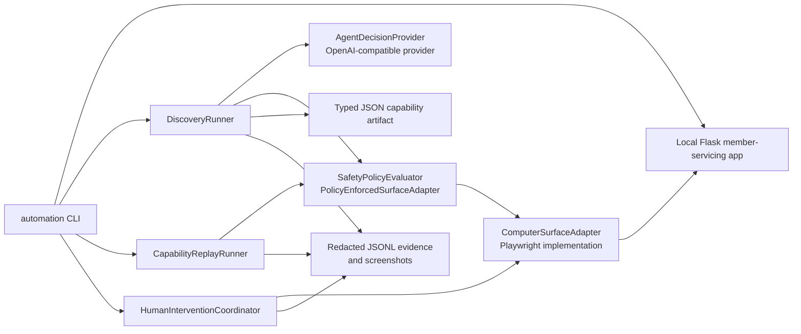

# Computer-Use Automation System

This repository is a focused vertical slice of a computer-use automation system for a local legacy-style member-servicing application. An OpenAI-compatible model can discover a browser flow, the successful path is represented as a typed JSON capability artifact, and the artifact can be replayed deterministically without an LLM. The repository also includes explicit safety checks, redacted JSONL evidence, and a minimal same-session human handoff.

The demo application uses synthetic member data only. It is not a banking integration and does not process real credentials, transactions, or PII.

## Architecture



Discovery uses the model only to propose a validated next decision. Every action is converted to a typed action model and evaluated by the safety policy before it reaches the Playwright adapter. Replay consumes the saved artifact in order and never invokes a model.

## Prerequisites

- Python 3.11 or newer.
- Google Chrome installed. The tests and CLI use Playwright's `channel="chrome"` because the bundled Chromium build may not support the host macOS version.
- An OpenAI-compatible model endpoint and API key only for the live discovery command.

Install the project and test dependencies:

```bash
python3 -m pip install -e '.[test]'
```

On macOS installations enforcing PEP 668, use the repository virtual environment or the environment-specific equivalent. The project itself does not require a model key for tests, replay, the demo app, or the human-handoff demo.

## Local Demo Target

Start the local member-servicing application:

```bash
automation demo
```

It listens on `http://127.0.0.1:5001`. The target supports member lookup, member details, savings-balance extraction, a sub-account review/confirmation flow, validation errors, a member-not-found result, a simulated delay, and a simulated dialog.

## Live Discovery

Configure the provider in the shell. `OPENAI_BASE_URL` is optional and defaults to `https://api.openai.com/v1`.

```bash
export OPENAI_API_KEY="your-api-key"
export OPENAI_BASE_URL="https://api.openai.com/v1"
export OPENAI_MODEL="gpt-4o-mini"
```

With the demo running in another terminal, run:

```bash
automation discover \
  --goal "look up member 12345 and read the current savings balance" \
  --member-id 12345
```

This writes `evidence/discovery-artifact.json` when the discovery result is successful and writes `evidence/discovery-run.jsonl`. The model response must conform to the structured decision schema. The command is the genuine-provider path; this repository does not include or claim a completed live model run.

## Deterministic Replay

Replay the checked-in synthetic artifact without an LLM:

```bash
automation replay examples/member_savings_balance.json --member-id 12345
```

Replay requires the local demo app to be running. The result is printed as structured JSON and the run is recorded in `evidence/replay-run.jsonl`. Failure screenshots are written under `evidence/replay-failures/` when a failure occurs.

## Exceptional Outcome

Run the same artifact with a member ID that is intentionally absent from the demo data:

```bash
automation replay-not-found examples/member_savings_balance.json
```

The expected result is a `business_outcome` result with code `MEMBER_NOT_FOUND`, not an automation crash. Evidence is written to `evidence/replay-not-found.jsonl`.

## Human Handoff

Exercise a real Playwright session handoff, operator click, evidence capture, and resume:

```bash
automation human-demo
```

The command opens the demo detail page with a simulated session dialog, transfers the existing browser session to the human owner, performs the operator dismissal through the adapter, then signals resume. It writes transfer/action records to `evidence/human-intervention.jsonl` and screenshots to `evidence/human-intervention/`. The command is a deterministic demonstration of the handoff seam, not a full operator console.

## Tests and Checks

Run the complete suite:

```bash
python3 -m pytest -q
```

Run a static syntax check:

```bash
python3 -m compileall -q src tests
```

No separate lint configuration is included in this focused repository. `git diff --check` is also useful for whitespace validation:

```bash
git diff --check
```

## Evidence

Evidence is JSONL so each event can be processed independently. CLI-created events include a run ID, UTC timestamp, capability ID and artifact schema version when applicable, action/result information, checkpoint/result information, control-transfer records, and screenshot references. Replay and handoff failure paths capture screenshots through the surface adapter.

The default evidence paths are:

- `evidence/discovery-run.jsonl`
- `evidence/replay-run.jsonl`
- `evidence/replay-not-found.jsonl`
- `evidence/human-intervention.jsonl`
- `evidence/replay-failures/`
- `evidence/human-intervention/`

Evidence is generated at runtime and is not treated as proof of a real LLM run. The checked-in example under `examples/` is a synthetic artifact.

## Security

The policy checks target origins/routes and permitted action types before surface actions execute. Irreversible actions require confirmation or are denied by policy. Runtime invocation values are held in memory and artifact fill steps contain symbolic references such as `${member_id}`. The evidence writer redacts configured sensitive field names and token/header patterns before writing JSONL. Do not put API keys in artifacts, logs, source files, or committed evidence.

## Limitations

- The demo target is local and synthetic; no real banking system is integrated.
- The live provider path supports one OpenAI-compatible chat-completions-style endpoint and depends on the provider accepting the generated JSON schema format.
- Replay supports the deliberately small V1 action vocabulary and bounded transient retry; it does not perform open-ended recovery.
- The operator path is a scripted command using a coordinator API, not a multi-user real-time console.
- Native desktop and accessibility-tree adapters are design extensions, not implemented surfaces.
- There is no distributed execution, artifact catalog, approval workflow, tenant service, or automatic drift remediation.
- A live model discovery run must be performed manually with the evaluator's own credentials; none is fabricated by this repository.
